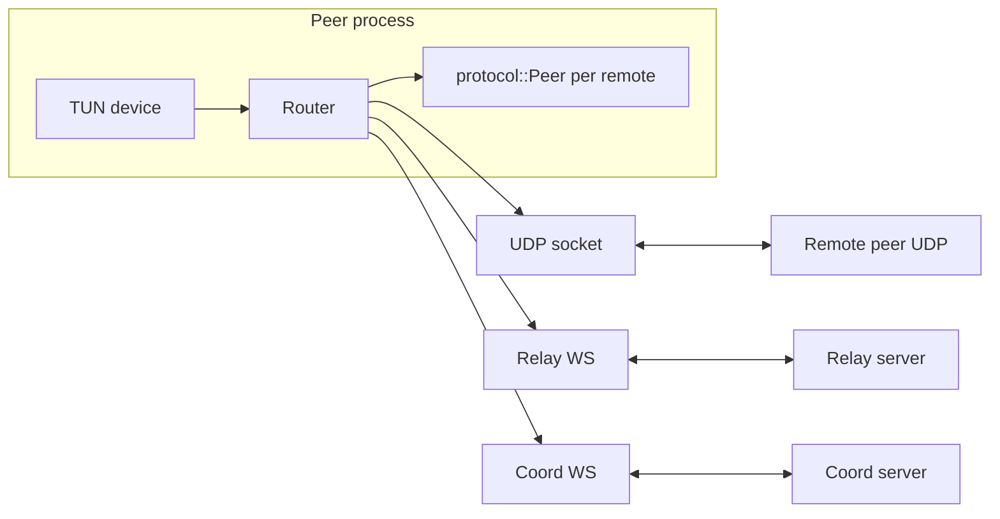

# VPN implementation (opentun)

This document describes how the **opentun** IP tunnel works in code: layers, processes, cryptography, and path selection. For install, CLI, and YAML examples, see the project [README](../README.md).

## What it is

opentun is a **relay-first virtual IP overlay**. Each **peer** exposes a TUN interface with a private tunnel address. IPv4 packets destined for a configured peer tunnel IP are wrapped in a **Noise**-protected protocol, sent over **UDP** (direct) and/or a **WebSocket relay**, with **coordination** used to exchange NAT traversal **candidates** (local, STUN reflexive, relay). Traffic starts on the relay path; **direct UDP** is probed in parallel and becomes active after **authenticated** packets are seen on that path. If a direct path goes quiet, the implementation **falls back to relay**.

## Process roles

| Role      | Responsibility                                                                                                                     |
| --------- | ---------------------------------------------------------------------------------------------------------------------------------- |
| **Peer**  | TUN read/write, UDP bind, relay WebSocket client, coordination WebSocket client, periodic timer (keepalives, probes, timeouts).    |
| **Relay** | WebSocket server: forwards opaque binary blobs between peers keyed by **Curve25519 public key**; does not decrypt tunnel payloads. |
| **Coord** | WebSocket server: registers peers and **caches/forwards** candidate lists so each side learns the other’s addresses.               |

Roles are selected via CLI (`--peer`, `--relay`, `--coord`) or `node_roles` in `config.yaml`. Peers require non-empty `coordination_url`, `relay_urls`, and `peers`.

## Runtime architecture

- `**Router**` (`src/net/router.rs`) maps tunnel IPs and UDP endpoints to each `protocol::Peer`, applies coordination updates, and turns protocol **outputs** into I/O **actions** (`UdpSend`, `RelaySend`, `TunSend`, `CoordSend`, `Log`).
- `**Dispatcher`** (`src/tasks/mod.rs`) sends those actions to the appropriate Tokio tasks (unbounded channels).

Peer startup (`run_peer`): create TUN and UDP socket → build `Router::from_config` → **STUN** candidate discovery (`src/control/stun.rs`) → `bootstrap()` (handshake init on relay for initiators, publish candidates) → spawn tasks: `tun`, `udp`, `relay` client, `coord` client, `timer`.

**Note:** `src/net/mod.rs` still contains older ChaCha20-Poly1305 TUN/UDP helpers; the **live** data path uses `Router` and `src/protocol/` only.

## Cryptography and wire format

- **Handshake:** Noise **IK** (and IKpsk2 when a PSK is configured) via the `snow` crate, pattern `Noise_IK_25519_ChaChaPoly_BLAKE2s` (see `src/protocol/peer.rs`).
- **Initiator vs responder:** Derived by comparing **local** and **remote** static public keys (lexicographic); lower key is initiator (`src/net/router.rs`).
- **Transport:** After handshake, payloads are **Noise transport** messages with a **monotonic counter**; duplicates are rejected by a **replay window** (`ReplayWindow` in `peer.rs`).
- **Framing:** Application packets are `WirePacket` values (`src/protocol/wire.rs`): tagged header (19 bytes) + payload. Tags include handshake init/response, transport data, and keepalive.

Relay and UDP both carry the **same** serialized `WirePacket` bytes; the relay only wraps them in `RelayFrame` (see below).

## Paths and candidate exchange

- `**PathManager`** (`src/protocol/path.rs`) tracks **relay** (fixed id `RELAY_PATH_ID`) and **direct** paths (one id per candidate socket address). The **active path** is where new sends go.
- **Candidates:** `Lan`, `Reflexive` (STUN), `Relay`. Local candidates are discovered at startup and published through coordination as JSON `CoordMessage` (`src/control/coord.rs`: `PublishCandidates` / `PeerCandidates`).
- **Bootstrap:** Each peer’s static `sock_addr` from config is injected as a `Lan` candidate for the remote so there is always a direct path entry even before coordination.
- **Switching to direct:** On any **authenticated** receive (handshake progress, transport data, or keepalive) on a path that is not the home relay path, the implementation switches **active path** to that direct path (`record_authenticated_rx` / `switch_active_path` in `path.rs` / `peer.rs`).
- **Fallback:** If the active path is direct and no authenticated traffic is received for `DIRECT_PATH_TIMEOUT_MS` (30s), that path is **failed** and active path returns to relay.
- **Probing:** On a timer, keepalives are sent on direct paths every `PROBE_INTERVAL_MS` (5s) when established; the active path also gets keepalives when idle for `KEEPALIVE_INTERVAL_MS` (15s).

Path selection is **not** RTT-ranked today; it is **first successful authenticated direct path** that wins over relay until timeout.

## Relay framing

Binary WebSocket messages use `RelayFrame` (`src/relay/frame.rs`):

| Type            | Purpose                                                    |
| --------------- | ---------------------------------------------------------- |
| `PeerPresent`   | Client announces public key; server maps key → connection. |
| `SendPacket`    | Destination pubkey + opaque `WirePacket` bytes.            |
| `RecvPacket`    | Source pubkey + payload (server → client).                 |
| `Ping` / `Pong` | Optional latency / liveness (8-byte nonce).                |

Layout: `[u8 type][u32 BE payload_len][payload]`.

## Coordination protocol

JSON messages (`CoordMessage` in `src/control/coord.rs`):

- `Register` — pubkey + optional `coord_auth_token`.
- `PublishCandidates` — from publisher: self pubkey, **peer** pubkey, list of `CandidateRecord` (`lan` / `reflexive` / `relay`).
- `PeerCandidates` — server pushes another peer’s candidates to the subscriber.
- `Ping` / `Pong` — keepalive.

The server caches recent messages per client for late joiners (see `CoordServerState` in `coord.rs`).

## IPv4-only TUN path

`Router::handle_tun_packet` and `extract_dst_ip` in `router.rs` only parse **IPv4** headers to pick the next-hop peer. Non-IPv4 packets are ignored at this layer.

## Configuration touchpoints

- **Tunnel:** `name`, `address`, `mtu` (also passed into Noise MTU checks as `config.mtu` minus protocol overhead).
- **UDP:** `port` (bind); each `peers` entry maps **tunnel IP** → `sock_addr` (initial direct candidate) and `pub_key`.
- **Keys:** `secret` (base64 32-byte private), `pubkey` (base64 public). Use `cargo run -- genkey` and `cargo run -- pubkey`.
- **STUN:** `stun_servers` strings (`host:port` or resolvable name).

## Key source files

| Area                 | Path                                                           |
| -------------------- | -------------------------------------------------------------- |
| Entry / roles        | `src/main.rs`, `src/config/mod.rs`, `src/cli/`                 |
| Peer orchestration   | `src/tasks/mod.rs`, `src/tasks/{tun,udp,relay,coord,timer}.rs` |
| Routing + peer table | `src/net/router.rs`                                            |
| Sans-IO protocol     | `src/protocol/{peer,path,wire,errors,events}.rs`               |
| Relay codec          | `src/relay/frame.rs`, `src/tasks/relay.rs`                     |
| Coord codec + server | `src/control/coord.rs`                                         |
| STUN                 | `src/control/stun.rs`                                          |
| Crypto helpers       | `src/crypto/mod.rs`                                            |

## Testing

- `cargo test` — unit/integration coverage for wire format, relay, protocol, path logic.
- `scripts/e2e-vpn.sh` — Linux namespaces, local relay+coord, two peers, ping over TUN; use `OPENTUN_E2E_DIRECT=1` to exercise direct UDP upgrade (see README).

## Related design notes

- `protocol-ideas.md` — broader NAT/relay ideas (Tailscale-style) for future work.
- `sans-io-migration.md` — ongoing sans-IO refactor notes; the protocol core is already structured for deterministic `Input` → `Output` handling.

